# **Wearable JS Demo App**

This application shows all the features provided by HarmonyOS for wearable devices in one application.
## **Sensors**

| **Sensors** | **Screenshots** |
| ------ | ------ |
| **Heart Rate:** Measures the heart rate of a user. Before measuring the user's heart rate, we check whether the wearable's wearing state with the **Body State sensor**, and if it is worn, we measure the heart rate. | 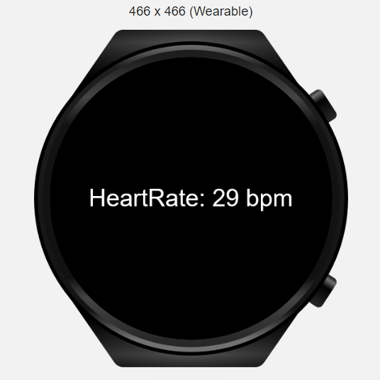 |
| **Light:** Measures the ambient light intensity of the device, in the unit of lux.| 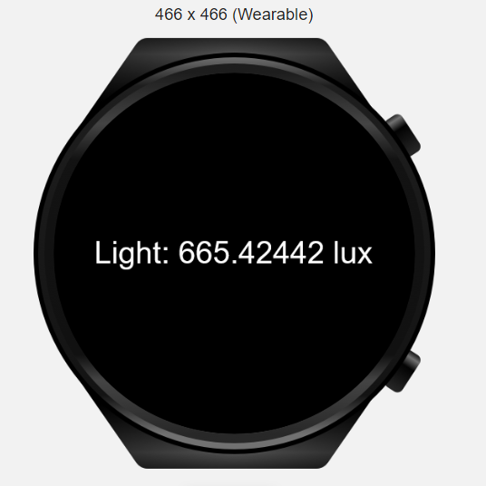 |
| **Compass:** Listens for changes of compass sensor data. If this API is called multiple times for the same application, the last call takes effect. | 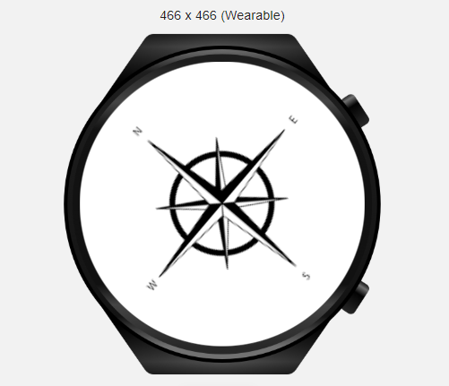 |
| **Accelerometer:** Listens for changes of acceleration sensor data. If this API is called multiple times for the same application, the last call takes effect.| 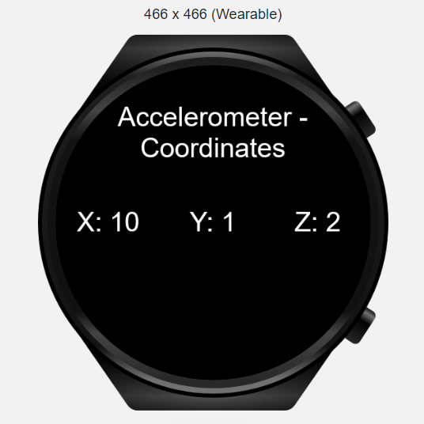 |
| **Barometer:** Listens for changes of barometer sensor data. If this API is called multiple times for the same application, the last call takes effect.| 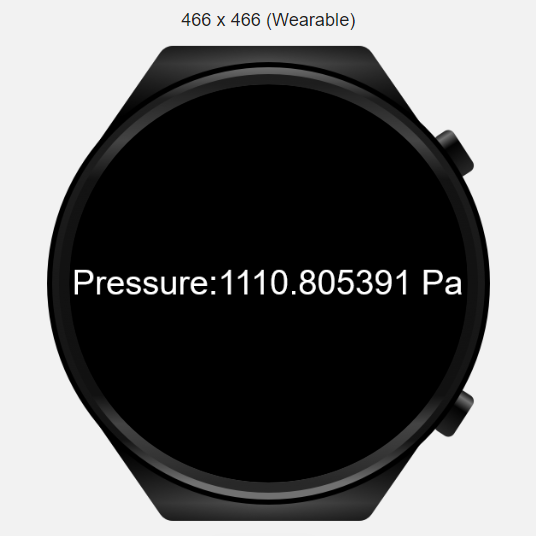 |
| **Step Counter:** Listens for changes of step counter sensor data. If this API is called multiple times for the same application, the last call takes effect.| 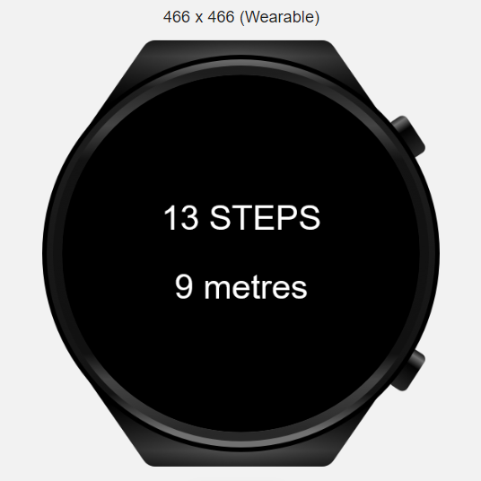 |

## **Basic Features**

| **Basic Feature** | **Screenshots** |
| ------ | ------ |
| **Animation:** Allows creating and playing animations.| 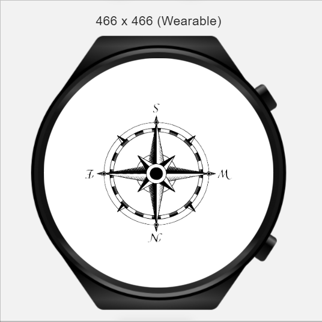 |
| **Timer:**  -**setTimeout** method sets a timer for the system to call a function after the timer goes off.  -**clearTimeout** method cancels the timer created via setTimeout().  -**setInterval** method sets a repeating timer for the system to repeatedly call a function at a fixed interval.  -**clearInterval** method cancels the repeating timer set via setInterval(). | 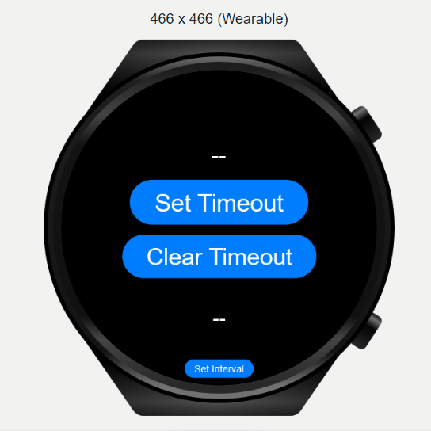 |
| **Application Configuration:**  -**getLocale** Obtains the current locale of the application, which is the same as the system locale. | 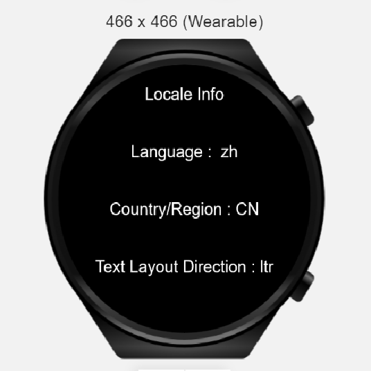 |
| **Pop-up Window:**  Allows displaying the toast message box and the dialog message box.| 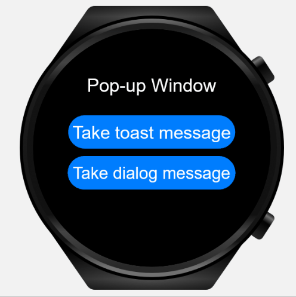 |

## **System Capabilities**

| **System Capability** | **Screenshots** |
| ------ | ------ |
| **Geographic Location:**  -**getLocation** method obtains the geographic location.  -**getLocationType** method obtains the supported location types.  -**subscribe** method listens to the geographical location. If this API is called multiple times, the last call takes effect.  -**unsubscribe** method cancels listening to the geographical location.  -**getSupportedCoordTypes** method obtains coordinate system types supported by the device. |  |
| **Vibration:**  Allows the device to create a vibration effect. The value long indicates long vibration, and short indicates short vibration. | 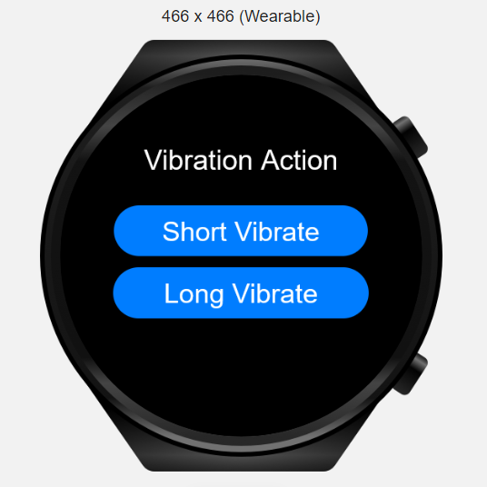 |
| **Battery Level:**  Obtains the current charging state and battery level of the device. **Charging** indicates whether the battery is being charged. **Level** indicates the current battery level, which ranges from 0.00 to 1.00.| 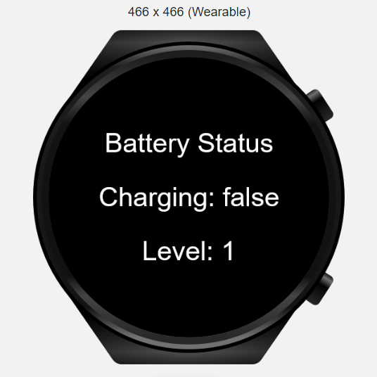 |
| **Application Management:**  Check if the app installed on the device using  **hasInstalled** API. | 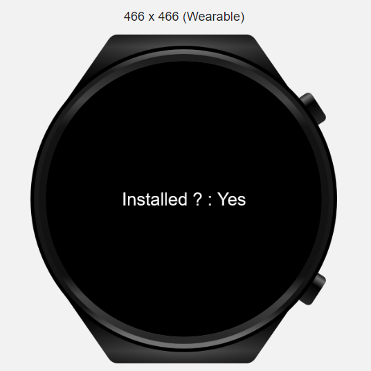 |
| **Device Information:**  Shows detailed information of the device. | 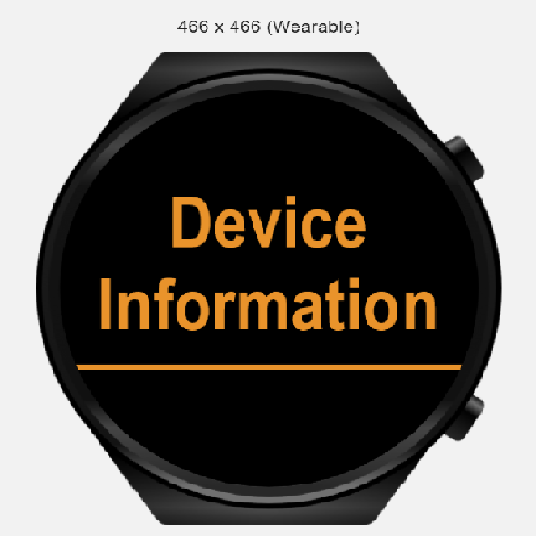 |
| **Screen Brightness:**   **- setValue:** Changes the screen brightness with given value.  **- getValue:** Gets the current brightness of screen as an integer value.  **- setMode:** Sets the screen brightness adjustment mode. (The value can be 0 or 1.   **0:** The screen brightness is manually adjusted.  **1:** The screen brightness is automatically adjusted.)  **- keepScreenOn:** Sets whether to always keep the screen on.| 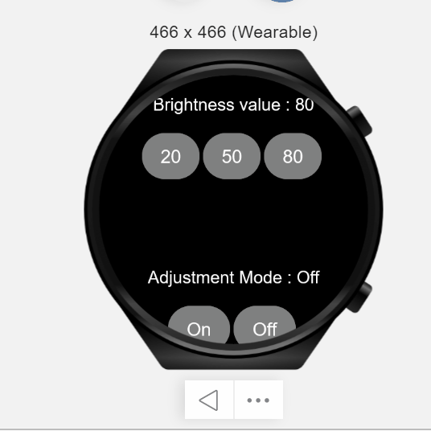 |
| **Network State:**  -**getType** method obtains the network type.  -**subscribe** method listens to the network connection state. If this method is called multiple times, the last call takes effect.  -**unsubscribe** method cancels listening to the network connection state.  | 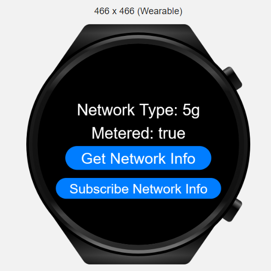 |