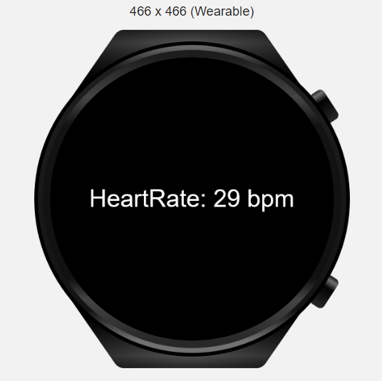
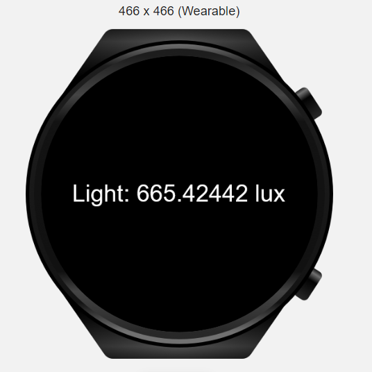

# **Wearable JS Demo App**

This application shows all the features provided by HarmonyOS for wearable devices in one application.
## **Sensors**

| **Sensors** | **Screenshots** |
| ------ | ------ |
| **Heart Rate:** Measures the heart rate of a user. Before measuring the user's heart rate, we check whether the wearable is wearing state with the **Body State sensor**, and if it is worn, we measure the heart rate. |  |
| **Light:** Measures the ambient light intensity of the device, in the unit of lux.|  |

