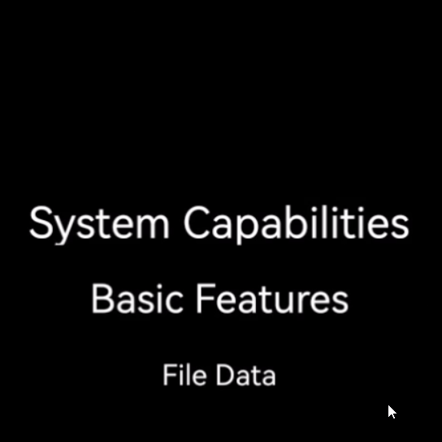
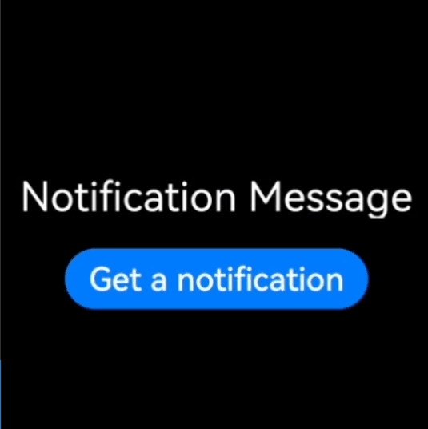
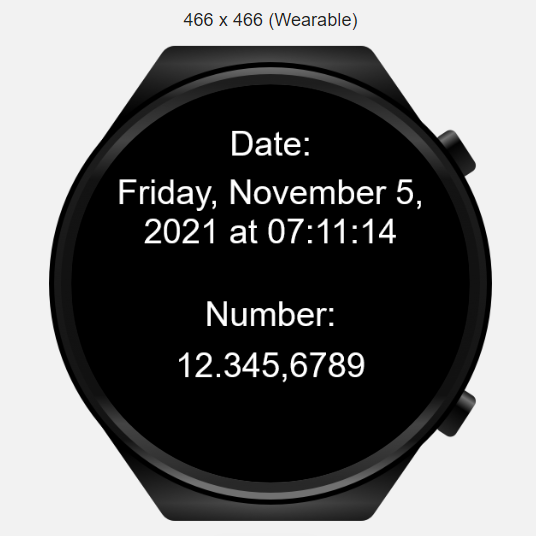
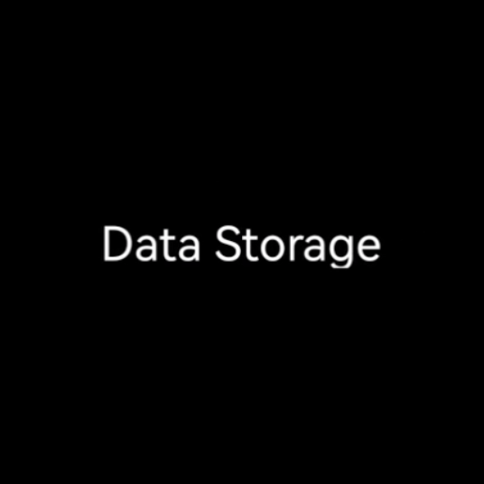
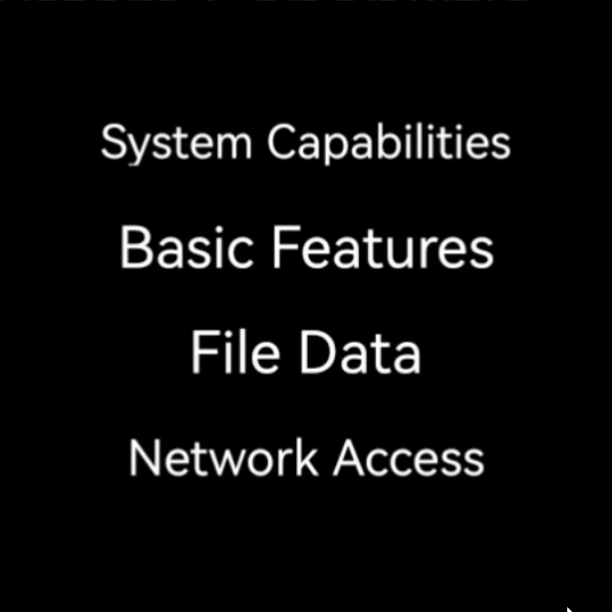

# **Wearable JS Demo App**

This application shows all the features provided by HarmonyOS for wearable devices in one application.

|  **Sensors** |  **Screenshots** |
| ------ | ------ |
| **Heart Rate:**  Measures the heart rate of a user. Before measuring the user's heart rate, we check whether the wearable's wearing state with the **Body State sensor**, and if it is worn, we measure the heart rate. |  |
| **Light:**  Measures the ambient light intensity of the device, in the unit of lux.|  |
| **Compass:**  Listens for changes of compass sensor data. If this API is called multiple times for the same application, the last call takes effect. |  |
| **Accelerometer:**  Listens for changes of acceleration sensor data. If this API is called multiple times for the same application, the last call takes effect.|  |
| **Barometer:**  Listens for changes of barometer sensor data. If this API is called multiple times for the same application, the last call takes effect.|  |
| **Step Counter:**  Listens for changes of step counter sensor data. If this API is called multiple times for the same application, the last call takes effect.|  |
|  **Basic Feature** |  **Screenshots** |
| **Animation:** Allows creating and playing animations.  **- requestAnimationFrame** Requests an animation frame.  **- cancelAnimationFrame** Cancels the animation frame request.  **- createAnimator** Creates an animation object.|  |
| **Timer:**  -**setTimeout** method sets a timer for the system to call a function after the timer goes off.  -**clearTimeout** method cancels the timer created via setTimeout().  -**setInterval** method sets a repeating timer for the system to repeatedly call a function at a fixed interval.  -**clearInterval** method cancels the repeating timer set via setInterval(). |  |
| **Application Configuration:**  -**getLocale** Obtains the current locale of the application, which is the same as the system locale. |  |
| **Pop-up Window:**  Allows displaying the toast message box and the dialog message box.|  |
|  **System Capability** |  **Screenshots** |
| **Geographic Location:**  -**getLocation** method obtains the geographic location.  -**getLocationType** method obtains the supported location types.  -**subscribe** method listens to the geographical location. If this API is called multiple times, the last call takes effect.  -**unsubscribe** method cancels listening to the geographical location.  -**getSupportedCoordTypes** method obtains coordinate system types supported by the device. |  |
| **Vibration:**  Allows the device to create a vibration effect. The value long indicates long vibration, and short indicates short vibration. |  |
| **Battery Level:**  Obtains the current charging state and battery level of the device. **Charging** indicates whether the battery is being charged. **Level** indicates the current battery level, which ranges from 0.00 to 1.00.|  |
| **Application Management:**  Check if the app installed on the device using  **hasInstalled** API. |  |
| **Device Information:**  Shows detailed information of the device. |  |
| **Screen Brightness:**   **- setValue** Changes the screen brightness with given value.  **- getValue** Gets the current brightness of screen as an integer value.  **- setMode** Sets the screen brightness adjustment mode. (The value can be 0 or 1.   **0** The screen brightness is manually adjusted.  **1** The screen brightness is automatically adjusted.)  **- keepScreenOn** Sets whether to always keep the screen on.|  |
| **Network State:**  -**getType** method obtains the network type.  -**subscribe** method listens to the network connection state. If this method is called multiple times, the last call takes effect.  -**unsubscribe** method cancels listening to the network connection state.  |  |
| **Notification Message:** Allows us to send notification messages to the wearable device. -**contentTitle** parameter specifies the notification title. -**contentText** parameter specifies the notification content. -**clickAction** parameter gets the action triggered when the notification is clicked.  |  |
| **Globalization:**  -**Intl.DateTimeFormat** represents localized date and time formats for corresponding countries or regions. You can customize date and time formats.  -**Intl.NumberFormat** represents localized number formats for corresponding countries or regions. You can customize a number format.  |  |
| **Media Query:**  -**mediaquery.matchMedia(condition)** Creates a MediaQueryList object based on the query condition.  -**MediaQueryList.addListener(OBJECT)** Adds a listening function to MediaQueryList. The listening function must be added before onShow is called, that is, added in the onInit or onReady function. |  |
|  **File Data** |  **Screenshots** |
| **Data Storage:**  -**get** method reads the stored content.  -**set** method modifies the stored content.  -**clear** method clears the stored content.  -**delete** method deletes the stored content.  |  |
|  **Network Access** |  **Screenshots** |
| **Data Request:**  -**fetch** method obtains data through a network.    |  |
|  **Distributed Capability** |  **Screenshots** |
| **Distributed Start & Migration:**  With the distributed start capability, you can start a local or remote FA with parameters passed. Distributed migration provides a proactive migration API and a series of page lifecycle callbacks to seamlessly migrate local services to specified devices.  |  |