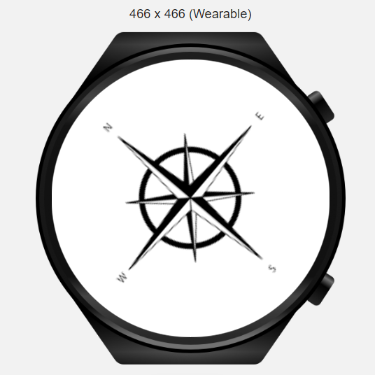

# **Wearable JS Demo App**

This application shows all the features provided by HarmonyOS for wearable devices in one application.
## **Sensors**

| **Sensors** | **Screenshots** |
| ------ | ------ |
| **Heart Rate:** Measures the heart rate of a user. Before measuring the user's heart rate, we check whether the wearable's wearing state with the **Body State sensor**, and if it is worn, we measure the heart rate. |  |
| **Light:** Measures the ambient light intensity of the device, in the unit of lux.|  |
| **Compass:** Listens for changes of compass sensor data. If this API is called multiple times for the same application, the last call takes effect. |  |
| **Accelerometer:** Listens for changes of acceleration sensor data. If this API is called multiple times for the same application, the last call takes effect.|  |
| **Barometer:** Listens for changes of barometer sensor data. If this API is called multiple times for the same application, the last call takes effect.|  |
| **Step Counter:** Listens for changes of step counter sensor data. If this API is called multiple times for the same application, the last call takes effect.|  |

## **Basic Features**

| **Basic Feature** | **Screenshots** |
| ------ | ------ |
| **Animation:** Allows creating and playing animations.|  |
## **System Capabilities**

| **System Capability** | **Screenshots** |
| ------ | ------ |
| **Screen Brightness:**   **- setValue:** Changes the screen brightness with given value.  **- getValue:** Gets the current brightness of screen as an integer value.  **- setMode:** Sets the screen brightness adjustment mode. (The value can be 0 or 1.   **0:** The screen brightness is manually adjusted.  **1:** The screen brightness is automatically adjusted.)  **- keepScreenOn:** Sets whether to always keep the screen on.|  |
                                                                                                                                                                                                                                             
                                                                                                                                                                                                                                           
                                                                                                                                                                                                                                             
                                                                                                                                                                                                                                              